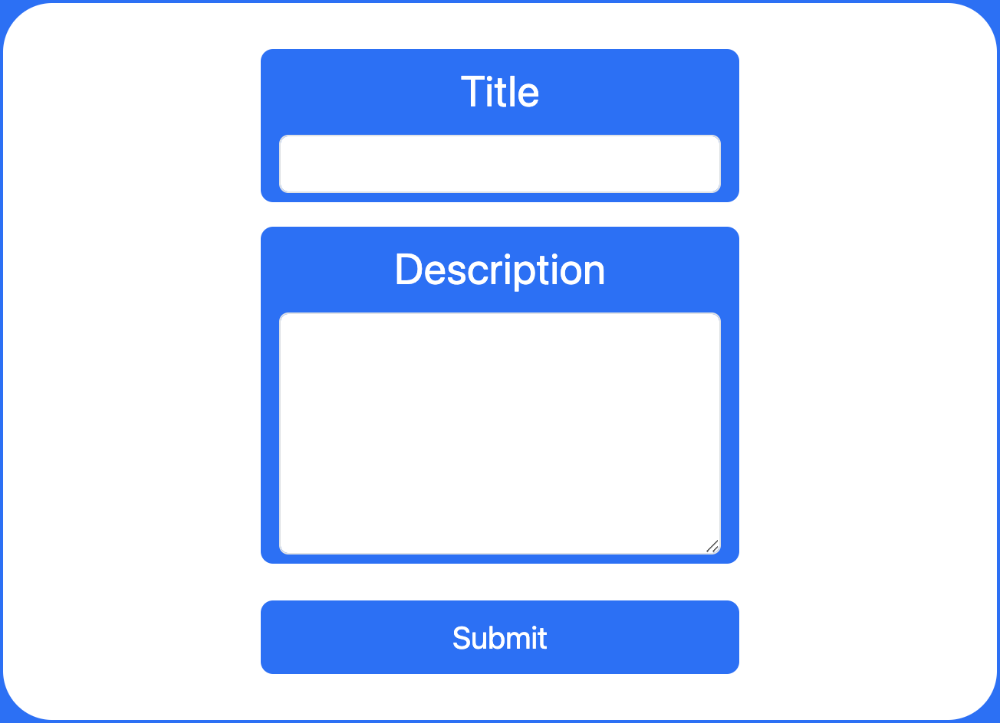

# { Tech Blog }

---

## Table of Contents

- [Description](#description)
- [Installation](#installation)
- [Usage](#usage)
- [Credits](#credits)
- [Resources](#resources)
- [Toolset](#toolset)
- [Contribute](#contribute)
- [Questions](#questions)

## Description
This is a CMS-style blog, where developers can publish their blog posts and comment on other developers' posts as well. This app was built completely from scratch and deployed to Heroku. It follows the MVC paradigm in its architectural structure, using Handlebars.js as the templating language, Sequelize as the ORM, and the express-session npm package for authentication.

## Installation
Follow these commands to run the command-line application:  

    git clone repository
    npm i
    npm start
    open at http://localhost:3001/

## Usage

  
  
  

## Credits

:bust_in_silhouette: [David Michael Mackey](https://www.notion.so/davidmichaelmackey/David-Mackey-a59ce61a996840d6a933e3b135673467?pvs=4) 
:email: [Email](mailto:davidmackey@hey.com) 
:octocat: [GitHub](https://github.com/davidmichaelmackey/) 
:briefcase: [Linkedin](https://linkedin.com/in/davidmichaelmackey/) 

### Resources

  [MVC](https://developer.mozilla.org/en-US/docs/Glossary/MVC) 
  [Sequelize](https://sequelize.org/docs/v6/core-concepts/model-basics) 
  [Express Handlebars](https://www.npmjs.com/package/express-handlebars) 
  [Express Session](https://www.npmjs.com/package/express-session) 
  [Express Middleware](https://expressjs.com/en/guide/using-middleware.html) 
  [ESLint](https://eslint.org/docs/latest/use/configure/) 
  [Prettier](https://prettier.io/docs/en/index.html)

## Toolset

## Contribute

[Contributor Covenant](https://www.contributor-covenant.org/)

## Questions

Have Questions? Feel free send me an [email](mailto:davidmackey@hey.com) or reach out to me on [Linkedin](https://linkedin.com/in/davidmichaelmackey/).
